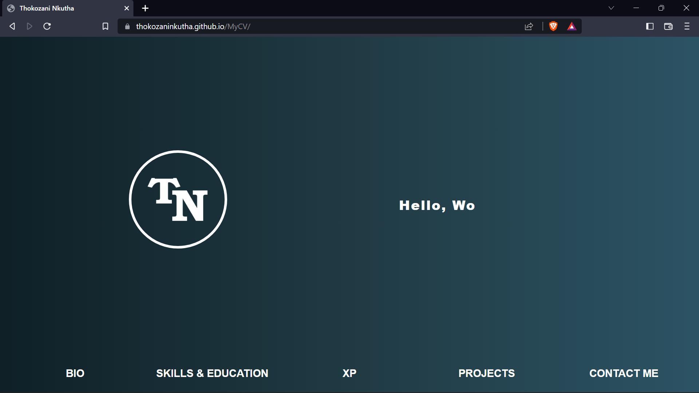

# My CV

## Table of Contents
- [Description](#description)
- [Introduction](#introduction)
- [Usage](#usage)
- [Installation](#installation)
- [Credits](#credits)

## Description

This is my CV / Developer's portfolio

## Introduction

This CV gives details about:

* My skills and education
* My experience
* Projects I've worked on

## Usage

How you can enjoy the site:

Treat it like a museum of some sort .. take a look at the art. And if you would like to see more from the artists or models, you can click on their names on the website and you'll be redirected to their instagram profiles.

What you can do:

* Read important information about me.
* View projects I have worked on
* See all the different ways you can reach out to me.

Screenshots of the project:

## Installation

How to install:

* Clone the project

## How to view:

* Use the link: thokozaninkutha.github.io/MyCV

## How to tweak the project for your own use:

You may clone and rename the project to use for your own purposes

## Found a bug?

If you found an issue or would like to submit an improvement to this project, please submit an issue using the issues tab above.

## Credits

The codepen I used has a link commented in the files where the code is used.
